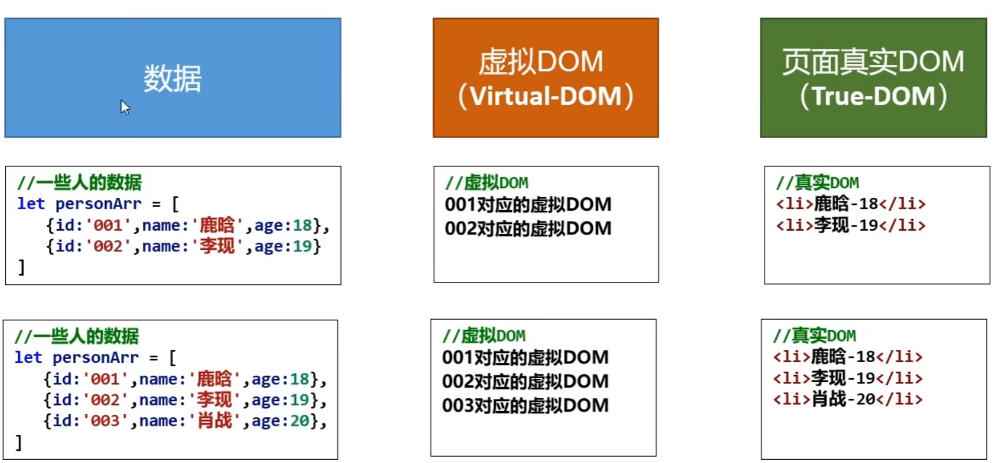
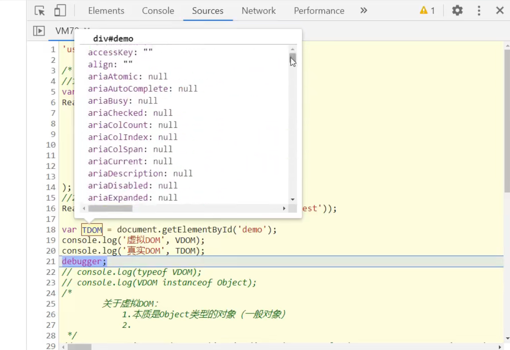
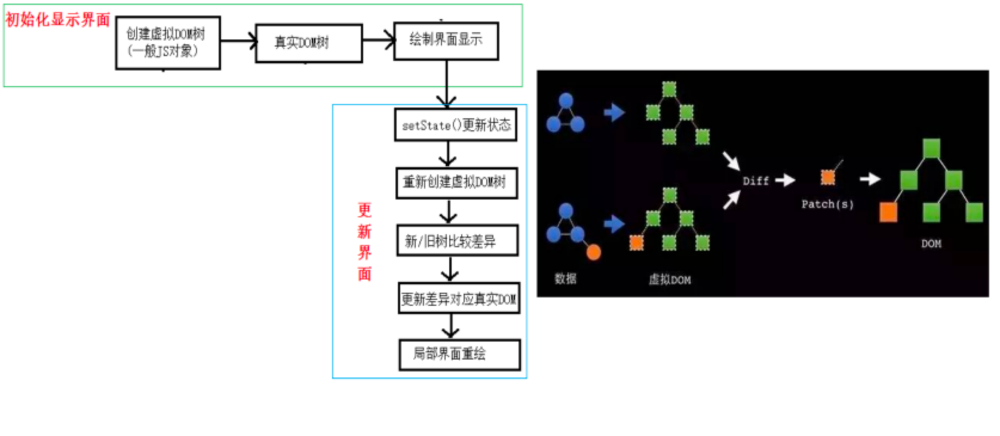

# react基础

### React 是什么？

```
用于构建用户界面的 JavaScript 库，由facebook开发的且开源的
```

### react关键库
```
1.react.js：React核心库。

2.react-dom.js：提供操作DOM的react扩展库。

3.babel.min.js：解析JSX语法代码转为JS代码的库。浏览器不能直接解析JSX代码, 需要babel转译为纯JS的代码才能运行
```

### 原生javascript操作dom


### 原生dom开发的痛点


```
不管是原始dom-api很繁琐，后面jquery也只是使得代码量减少了些，但都是直接操作原始dom，导致重绘重排。
```

### 为何要使用React(React 的特点)


### 虚拟DOM与真实DOM
```
1.React提供了一些API来创建一种 “特别” 的普通js对象，叫做虚拟DOM对象
 const VDOM = React.createElement('标签名字',{id:'标签属性'},'标签的children')

2.虚拟DOM对象最终都会被React转换为真实的DOM

3.我们编码时基本只需要操作react的虚拟DOM相关数据, react会转换为真实DOM变化而更新界。
```
### 原生js直接操作dom来更新视图原理


```
只是更新一个名字，也是对整个列表的全部替换，一个也没有复用
```

### react操作虚拟dom对象来更新视图原理

```
对两次虚拟dom进行比较,复用旧的dom，生成新的dom，然后再渲染处理
```
### 创建虚拟DOM的两种方式
```
1.纯JS方式(一般不用)
2.JSX方式
```

#### react jsx实现
``` js 
<!DOCTYPE html>
<html lang="en">
<head>
	<meta charset="UTF-8">
	<title>1_使用jsx创建虚拟DOM</title>
</head>
<body>
	<!-- 准备好一个“容器” -->
	<div id="test"></div>

	<!-- 引入react核心库 -->
	<script type="text/javascript" src="../js/react.development.js"></script>
	<!-- 引入react-dom，用于支持react操作DOM -->
	<script type="text/javascript" src="../js/react-dom.development.js"></script>
	<!-- 引入babel，用于将jsx转为js -->
	<script type="text/javascript" src="../js/babel.min.js"></script>

	<script type="text/babel" > /* 此处一定要写babel */
		//1.创建虚拟DOM
		const VDOM = (  /* 此处一定不要写引号，因为不是字符串 */
			<h1 id="title">
				<span>Hello,React</span>
			</h1>
		)
		//2.渲染虚拟DOM到页面
		ReactDOM.render(VDOM,document.getElementById('test'))
	</script>
</body>
</html>
```

#### react js 实现
``` js
<!DOCTYPE html>
<html lang="en">
<head>
	<meta charset="UTF-8">
	<title>2_使用js创建虚拟DOM</title>
</head>
<body>
	<!-- 准备好一个“容器” -->
	<div id="test"></div>

	<!-- 引入react核心库 -->
	<script type="text/javascript" src="../js/react.development.js"></script>
	<!-- 引入react-dom，用于支持react操作DOM -->
	<script type="text/javascript" src="../js/react-dom.development.js"></script>

	<script type="text/javascript" > 
		//1.创建虚拟DOM
		const VDOM = React.createElement('h1',{id:'title'},React.createElement('span',{},'Hello,React'))
		//2.渲染虚拟DOM到页面
		ReactDOM.render(VDOM,document.getElementById('test'))
	</script>
</body>
</html>
```

#### 在网页上观察此html


#### 大概看看 虚拟dom的真面目


#### 大概看看 真实dom的真面目


### 总结虚拟dom
```
1.本质是Object类型的对象（一般对象）

2.虚拟DOM比较“轻”，真实DOM比较“重”，因为虚拟DOM是React内部在用，无需真实DOM上那么多的属性。

3.虚拟DOM最终会被React转化为真实DOM，呈现在页面上。所以我们编码时基本只需要操作react的虚拟DOM相关数据
```

### JSX 是什么
```
1.全称:  JavaScript XML

2.是react定义的一种类似于XML的JS扩展语法: JS + XML 本质是React.createElement(component, props, ...children)方法的语法糖

3.作用: 用来简化创建虚拟DOM 
	1)写法：var ele = <h1>Hello JSX!</h1>
	2)注意1：它不是字符串, 也不是HTML/XML标签
	3)注意2：它最终产生的就是一个JS对象
```

#### jsx 转化过程


#### 参考：jsx语法代码
``` js 
	<script type="text/babel" >
		const myId = 'aTgUiGu'
		const myData = 'HeLlo,rEaCt'

		//1.创建虚拟DOM
		const VDOM = (
			<div>
				<h2 className="title" id={myId.toLowerCase()}>
					<span style={{color:'white',fontSize:'29px'}}>{myData.toLowerCase()}</span>
				</h2>
				<h2 className="title" id={myId.toUpperCase()}>
					<span style={{color:'white',fontSize:'29px'}}>{myData.toLowerCase()}</span>
				</h2>
				<input type="text"/>
				<Good>这种就是自定义组件</Good>
			</div>
		)
		//2.渲染虚拟DOM到页面
		ReactDOM.render(VDOM,document.getElementById('test'))
	</script>
```


### 参考：diff算法流程
