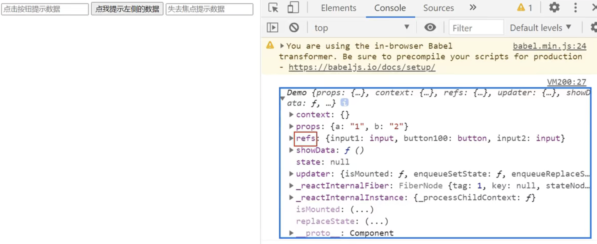

# React面向组件编程

### React模块
```
1.理解：向外提供特定功能的js程序, 一般就是一个js文件

2.为什么要拆成模块：随着业务逻辑增加，代码越来越多且复杂。

3.作用：复用js, 简化js的编写, 提高js运行效率

```

### React组件
```
1.理解：用来实现局部功能效果的代码和资源的集合(html/css/js/image等等)

2.为什么要用组件： 一个界面的功能更复杂

3.作用：复用编码, 简化项目编码, 提高运行效率
```


### class 类式组件 (一般用于复杂类型组件：复杂与简单取决于有无this.state)
``` js
<script type="text/babel">
		//1.创建类式组件
		class MyComponent extends React.Component {
			render(){
				console.log('render中的this:',this);
				return <h2>我是用类定义的组件(适用于【复杂组件】的定义)</h2>
			}
		}
		//2.渲染组件到页面
		ReactDOM.render(<MyComponent/>,document.getElementById('test'))
	</script>
```

### 函数式组件 (一般用于简单类型组件)
``` js 
<script type="text/babel">
		//1.创建函数式组件
		function MyComponent(){
			console.log(this); //此处的this是undefined，因为babel编译后开启了严格模式
			return <h2>我是用函数定义的组件(适用于【简单组件】的定义)</h2>
		}
		//2.渲染组件到页面
		ReactDOM.render(<MyComponent/>,document.getElementById('test'))
	</script>
```


### 组件三大核心属性1: state
```
1.state是组件对象最重要的属性, 值是对象(可以包含多个key-value的组合)

2.组件被称为"状态机", 通过更新组件的state来更新对应的页面显示(重新渲染组件)

3.不能直接修改或更新
```

### state 使用示例
``` js

	<script type="text/babel">
		//1.创建组件
		class Weather extends React.Component{
			
			constructor(props){
				console.log('constructor');
				super(props)
				//初始化状态
				this.state = {isHot:false,wind:'微风'}
				//解决changeWeather中this指向问题
				this.changeWeather = this.changeWeather.bind(this)
			}

			//render调用几次？ ———— 1+n次 1是初始化的那次 n是状态更新的次数
			render(){
				console.log('render');
				//读取状态
				const {isHot,wind} = this.state
				return <h1 onClick={this.changeWeather}>今天天气很{isHot ? '炎热' : '凉爽'}，{wind}</h1>
			}

			changeWeather(){
				//类中的方法默认开启了局部的严格模式，所以changeWeather中的this为undefined
				
				console.log('changeWeather');
				//获取原来的isHot值
				const isHot = this.state.isHot
				//严重注意：状态必须通过setState进行更新,且更新是一种合并，不是替换。
				this.setState({isHot:!isHot})
				console.log(this);

				//严重注意：状态(state)不可直接更改，下面这行就是直接更改！！！
				//this.state.isHot = !isHot //这是错误的写法
			}
		}
		//2.渲染组件到页面
		ReactDOM.render(<Weather/>,document.getElementById('test'))
				
	</script>
```

### 组件三大核心属性2: props
```
1.每个组件对象都会有props(properties的简写)属性

2.组件标签的所有属性都保存在props中

3.通过标签属性从组件外向组件内传递变化的数据

4.注意: 组件内部不要修改props数据
```
#### props使用示例
```js

	<script type="text/babel">
		//创建组件
		class Person extends React.Component{
			render(){
				// console.log(this);
				const {name,age,sex} = this.props
				return (
					<ul>
						<li>姓名：{name}</li>
						<li>性别：{sex}</li>
						<li>年龄：{age+1}</li>
					</ul>
				)
			}
		}
		//渲染组件到页面
		ReactDOM.render(<Person name="jerry" age={19}  sex="男"/>,document.getElementById('test1'))
		ReactDOM.render(<Person name="tom" age={18} sex="女"/>,document.getElementById('test2'))

		const p = {name:'老刘',age:18,sex:'女'}
		// console.log('@',...p);
		// ReactDOM.render(<Person name={p.name} age={p.age} sex={p.sex}/>,document.getElementById('test3'))
		// 批量传属性
		// ... 是不能展开对象的， 直接使用 ...对象 ，会报错
		// 但是加个花括号： {...对象} 不会报错，是个复制对象操作
		// 而这里的花括号 是表情语法括号， 那这里 ...p 不会报错？ 
		// 在普通的js里是肯定会报错的。但是这里有react和babel ，他们允许这个操作。并且只允许在传参这里做展开
		ReactDOM.render(<Person {...p}/>,document.getElementById('test3'))
	</script>
```

### 组件三大核心属性3: refs与事件处理
``` 
用于在组件内的标签定义ref属性来标识（引用）自己
```

使用示例
```js
<script type="text/babel">
		//创建组件
		class Demo extends React.Component{
			//展示左侧输入框的数据
			showData = ()=>{
				const {input1} = this.refs // 返回的input1是个真实dom， 那么访问就是input.value
				alert(input1.value)
			}
			//展示右侧输入框的数据
			showData2 = ()=>{
				const {input2} = this.refs
				alert(input2.value)
			}
			render(){
				return(
					<div>
						<input ref="input1" type="text" placeholder="点击按钮提示数据"/>&nbsp;
						<button ref="button100" onClick={this.showData}>点我提示左侧的数据</button>&nbsp;
						<input ref="input2" onBlur={this.showData2} type="text" placeholder="失去焦点提示数据"/>
					</div>
				)
			}
		}
		//渲染组件到页面
		ReactDOM.render(<Demo a="1" b="2"/>,document.getElementById('test'))
	</script>
```

观察虚拟dom的数据结构



### 组件的重要的生命周期（钩子）

``` 
1.render：初始化渲染或更新渲染调用
2.componentDidMount：开启监听, 发送ajax请求
3.componentWillUnmount：做一些收尾工作, 如: 清理定时器
```

参考示例
``` js
<script type="text/babel">
		//创建组件
		//生命周期回调函数 <=> 生命周期钩子函数 <=> 生命周期函数 <=> 生命周期钩子
		class Life extends React.Component{

			state = {opacity:1}

			death = ()=>{
				//卸载组件
				ReactDOM.unmountComponentAtNode(document.getElementById('test'))
			}

			//组件挂完毕
			componentDidMount(){
				console.log('componentDidMount');
				this.timer = setInterval(() => {
					//获取原状态
					let {opacity} = this.state
					//减小0.1
					opacity -= 0.1
					if(opacity <= 0) opacity = 1
					//设置新的透明度
					this.setState({opacity})
				}, 200);
			}

			//组件将要卸载
			componentWillUnmount(){
				//清除定时器
				clearInterval(this.timer)
			}

			//初始化渲染、状态更新之后
			render(){
				console.log('render');
				return(
					<div>
						<h2 style={{opacity:this.state.opacity}}>React学不会怎么办？</h2>
						<button onClick={this.death}>不活了</button>
					</div>
				)
			}
		}
		//渲染组件
		ReactDOM.render(<Life/>,document.getElementById('test'))
	</script>
```

