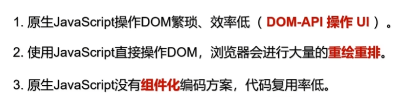

# react基础

### React 是什么？

```
用于构建用户界面的 JavaScript 库，由facebook开发的且开源的
```

### 原生javascript操作dom


### 原生dom开发的痛点


### 为何要使用React(React 的特点)


### react关键库
```
1.react.js：React核心库。
2.react-dom.js：提供操作DOM的react扩展库。
3.babel.min.js：解析JSX语法代码转为JS代码的库。
```

### babel.js的作用
```
1 浏览器不能直接解析JSX代码, 需要babel转译为纯JS的代码才能运行
2 只要用了JSX，都要加上type="text/babel", 声明需要babel来处理
```

### JSX 是什么
```
1.全称:  JavaScript XML 
2.react定义的一种类似于XML的JS扩展语法: JS + XML
  本质是React.createElement(component, props, ...children)方法的语法糖
```

### 虚拟DOM与真实DOM
```
1.React提供了一些API来创建一种 “特别” 的一般js对象
 const VDOM = React.createElement('xx',{id:'xx'},'xx')
 上面创建的就是一个简单的虚拟DOM对象
2.虚拟DOM对象最终都会被React转换为真实的DOM
我们编码时基本只需要操作react的虚拟DOM相关数据, react会转换为真实DOM变化而更新界。
```

### 原生js操作dom原理


### react的操作dom原理


### 创建虚拟DOM的两种方式
```
1.纯JS方式(一般不用)
2.JSX方式
```

### react jsx实现
``` js 
<!DOCTYPE html>
<html lang="en">
<head>
	<meta charset="UTF-8">
	<title>1_使用jsx创建虚拟DOM</title>
</head>
<body>
	<!-- 准备好一个“容器” -->
	<div id="test"></div>

	<!-- 引入react核心库 -->
	<script type="text/javascript" src="../js/react.development.js"></script>
	<!-- 引入react-dom，用于支持react操作DOM -->
	<script type="text/javascript" src="../js/react-dom.development.js"></script>
	<!-- 引入babel，用于将jsx转为js -->
	<script type="text/javascript" src="../js/babel.min.js"></script>

	<script type="text/babel" > /* 此处一定要写babel */
		//1.创建虚拟DOM
		const VDOM = (  /* 此处一定不要写引号，因为不是字符串 */
			<h1 id="title">
				<span>Hello,React</span>
			</h1>
		)
		//2.渲染虚拟DOM到页面
		ReactDOM.render(VDOM,document.getElementById('test'))
	</script>
</body>
</html>
```

### react js 实现
``` js
<!DOCTYPE html>
<html lang="en">
<head>
	<meta charset="UTF-8">
	<title>2_使用js创建虚拟DOM</title>
</head>
<body>
	<!-- 准备好一个“容器” -->
	<div id="test"></div>

	<!-- 引入react核心库 -->
	<script type="text/javascript" src="../js/react.development.js"></script>
	<!-- 引入react-dom，用于支持react操作DOM -->
	<script type="text/javascript" src="../js/react-dom.development.js"></script>

	<script type="text/javascript" > 
		//1.创建虚拟DOM
		const VDOM = React.createElement('h1',{id:'title'},React.createElement('span',{},'Hello,React'))
		//2.渲染虚拟DOM到页面
		ReactDOM.render(VDOM,document.getElementById('test'))
	</script>
</body>
</html>
```

#### 对应的html


#### 大概看看 虚拟dom的真面目


#### 大概看看 真实dom的真面目


### 总结虚拟dom
```
1.本质是Object类型的对象（一般对象）
2.虚拟DOM比较“轻”，真实DOM比较“重”，因为虚拟DOM是React内部在用，无需真实DOM上那么多的属性。
3.虚拟DOM最终会被React转化为真实DOM，呈现在页面上。
```

